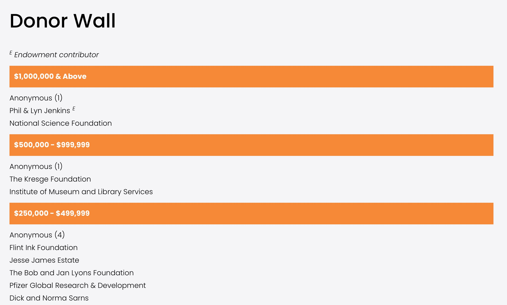

### Donor Wall

List of donors

The **do_donor_wall** custom function grabs data from a Google spreadsheet (Donor Wall) and creates a list of donors grouped by amount breakpoints.  

***Cook book***
- Edit the page
- Click a "+" sign where you want to insert 
- Select "Code"
- Paste the following code block
- Adust parameters as needed

**Code block for donor wall**
```
<script>
$( document ).ready(function() {
    do_donor_wall('#donorWall');
});
</script>
<div id="donorWall"></div>
``` 

**Overrides:**

None

**Usage:**

*do_donor_wall(Selector)*

**Parameters:**

<table class="ws-table-all notranslate"> 
  <tbody>
    <tr class="tableTop">
     <td style="width:120px">Parameter</td>
     <td>Description</td>
    </tr>
    <tr>
      <td><em>Selector</em></td>
      <td>Required.<br>jQuery selector identification where the resulting html code will be generated.</td>
    </tr>
  </tbody>
</table>

**Return Value:**

None

**Google Spreadsheet:**

<table class="ws-table-all notranslate"> 
  <tbody>
    <tr class="tableTop">
     <td style="width:120px">Detail</td>
     <td>Description</td>
    </tr>
    <tr>
      <td>Owner</td>
      <td>aahom220@gmail.com</td>
    </tr>
    <tr>
      <td>File Name</td>
      <td>Donor Wall</td>
    </tr>
    <tr>
      <td>Folder</td>
      <td><a href="https://drive.google.com/drive/folders/1YaVLSr9quHsbMDChBrlZUjpI_ZeG0cG-" target="_blank">UIL_Web_Site_Docs</a></td>
    </tr>
    <tr>
      <td>Link</td>
      <td><a href="https://docs.google.com/spreadsheets/d/1Euo2kWx3lMC60XIAE7oUgXjEjoXkktFU3cW3YpZKLKw/edit#gid=176165326" target="_blank">Google Calendar Spreadsheet</a></td>
    </tr>
    <tr>
      <td>ID</td>
      <td>1Euo2kWx3lMC60XIAE7oUgXjEjoXkktFU3cW3YpZKLKw</td>
    </tr>
    <tr>
      <td>Sheet Name</td>
      <td>DonorWall</td>
    </tr>
  </tbody>
</table>

**Spreadsheet Fields**

<table class="ws-table-all notranslate"> 
  <tbody>
    <tr class="tableTop">
    <td style="width:20px">Column</td>
    <td style="width:120px">Label</td>
    <td>Description</td>
    </tr>
    <tr>
    <td>A</td>
    <td>Min</td>
    <td>Amount of a major breakpoint</td>
  </tr>
  <tr>
    <td>B</td>
    <td>Total donors</td>
    <td>Number of donors contributing to this donation amount</td>
  </tr>
  <tr>
    <td>C</td>
    <td>Endowment</td>
    <td>Yes=This is an endowment gift.</td>
  </tr>
  <tr>
    <td>D</td>
    <td>Recent Year</td>
    <td>Most recent year for a gift by this donor.  This value is 
    not currently being used.</td>
    </tr>
  </tbody>
</table>

**Example Screenshot**


